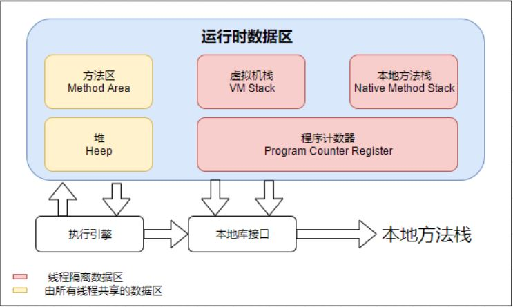

# Java内存区域与内存溢出

* [Java内存区域与内存溢出异常](#java内存区域与内存溢出异常)
  * [概述](#概述)
  * [运行时数据区域](#运行时数据区域)
    * [程序计数器](#程序计数器)
    * [Java虚拟机栈](#java虚拟机栈)
    * [本地方法栈](#本地方法栈)
    * [Java堆](#java堆)
    * [方法区](#方法区)
    * [运行时常量池](#运行时常量池)
    * [直接内存](#直接内存)

# Java内存区域与内存溢出异常
## 概述
对于Java程序员来说，在虚拟机自动内存管理机制的帮助下，不再需要为每一个new操作去写配对的delete/free代码，
不容易出现内存泄漏和内存溢出问题。  

本章从概念上介绍Java虚拟机内存的各个区域，讲解这些区域的作用、服务对象以及其中可能产生的问题。  
## 运行时数据区域
下图为Java虚拟机运行时数据区  

  
### 程序计数器  
**程序计数器**是一块较小的内存空间，它可以看作是当前线程所执行的字节码的行号指示器。在Java虚拟机的概念模型①里，
字节码解释器工作时就是通过改变这个计数器的值来选取下一条需要执行的字节码指令，它是程序控制流的指示器，
分支、循环、跳转、异常处理线程恢复等基础功能都需要依赖这个计数器来完成。  

为了线程切换后能恢复到正确的执行位置，每条线程都需要有一个独立的程序计数器。各条线程之间计数器互不影响，
独立储存，我们称这类内存区域为“*线程私有*”的内存。  

**如果线程正在执行的是一个Java方法，这个计数器记录的是正在执行的虚拟机字节码指令的地址；
如果正在执行的是本地（Native）方法，这个计数器值则应该为空**。
此内存区域没有规定任何 OutOfMemoryError 情况的区域。  

①“概念模型”这个词会被经常提及，它代表了所有虚拟机的统一外观。  
### Java虚拟机栈
与程序计数器一样，**Java虚拟机栈**也是线程私有的，它的生命周期与线程相同。虚拟机栈描述的是Java方法执行的线程内存模型：
每个方法被执行的时候，Java虚拟机都会同步创建一个栈帧②，用于存储局部变量表、操作数栈、动态连接、方法出口等信息。
每一个方法被调用直至执行完毕的过程，就对应着一个栈帧在虚拟机栈中从入栈到出栈的过程。  

经常有人把Java内存区域笼统地划分为堆内存（Heap）和栈内存（Stack），这里的“栈”通常就是指虚拟机栈，
或者更多情况下只是虚拟机栈中局部变量表部分。  

**局部变量表**存放了编译期可知的各种Java虚拟机基本数据类型、对象引用（不同于对象本身，
可能是一个指向对象起始地址的引用指针，也可能是指向一个代表对象的句柄）和
return Address类型（指向了一条字节码指令的地址）。  

这些数据类型在局部变量表重点存储空间以**局部变量槽（Slot）**来表示，
其中64位长度的long和double类型的数据会占用两个变量槽，其余的数据类型只占用一个。
局部变量表所需的内存空间在编译期间完成分配，在方法运行期间不会改变局部变量表的数量。  

如果线程请求的栈深度大于虚拟机锁允许的深度，将抛出 StackOverflowError 异常；
如果Java虚拟机栈容量可以动态扩展（HotSpot虚拟机的栈容量不可以动态扩展），
当栈扩展时无法申请到足够的内存会抛出 OutOfMemoryError 异常。  

### 本地方法栈
**本地方法栈**与虚拟机栈锁发挥的作用是非常相似的，其区别只是虚拟机栈为虚拟机执行Java方法（也就是字节码）服务，
而本地方法栈则是为虚拟机使用到的本地（Native）方法服务。  

HotSpot虚拟机直接就把本地方法栈与虚拟机栈合二为一，本地方法也会和Java虚拟机栈差不多抛异常。  
### Java堆
**Java堆**（Java Heap）是虚拟机所管理的内存中最大的一块。**Java堆是被所有线程共享的一块存储区域，
在虚拟机启动时创建**。此内存区域的唯一目的就是存放对象实例，**几乎所有的对象实例以及数组都在这里分配内存**。  

Java堆是垃圾收集器管理的内存区域，因此一些资料中它也被称作“**GC堆**”。  

Java堆既可以被实现称固定大小，也可以是扩展的，不过当前主流的Java虚拟机都是按照可扩展来实现的
（通过参数-Xmx 和 -Xms设定）。如果在Java堆中没有内存完成实例分配，并且堆也无法再扩展时，
Java虚拟机将会抛出OutOfMemory异常。  

### 方法区
**方法区**（非堆）与Java堆一样，是各个线程共享的内存区域，它用于存储已被虚拟机加载的类型信息、常量、静态变量、
即时编译器编译后的代码缓存等数据。  

这区域的内存回收目标主要是针对常量池的回收和对类型的卸载，如果方法区无法满足新的内存分配需求时，将抛出OutOfMemory异常。  
### 运行时常量池
**运行时常量池**是方法区的一部分。Class文件中除了有类的版本、字段、方法、接口等描述信息外，还有一项信息是**常量池表**，
用于存放编译器生成的各种字面量与符号引用，这部分的内容将在类加载后存放到方法去的运行时常量池中。  

运行时常量池相对于Class文件常量池的另外一个重要特征是具备动态性，Java语言并不要求常量一定只能在编译期才能生成，
也就是说，运行期间也可以将新的常量放入池中，这种特性被开发人员利用得比较多的便是 String 类的 intern() 方法。  

当常量池无法再申请到内存时会抛出 OutOfMemoryError  异常。  

### 直接内存
**直接内存**并不是虚拟机运行时数据区的一部分，在JDK 1.4 中新加入了NIO类，引入了一种基于通道与缓冲区的I/O风湿，
它可以使用Native（本地）函数库直接分配堆外内存，然后通过一个存储在Java对立面的 DirectByteBuffer 对象作为
这块内存的引用来进行操作。这样能在一些场景中显著提高性能，因为避免了在Java堆和Native堆中来回复制数据。  

本机直接内存的分配不会收到Java堆大小的限制。  

